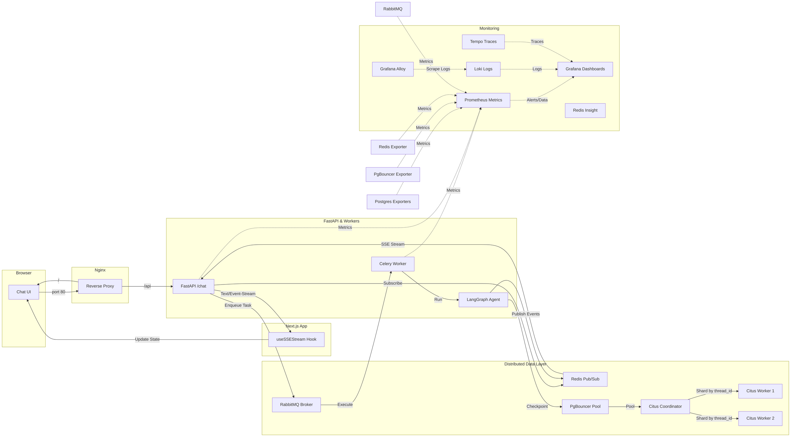

# fictional-bassoon

FastAPI SSE streaming backend for a LangGraph Deep Agent, paired with a Next.js chat frontend.

## Overview

This project is a full-stack AI chat application that streams real-time agent reasoning, tool calls, tool results, and final answers to the browser via Server-Sent Events (SSE). It features a robust, distributed architecture designed for observability and scalability, consolidated behind an Nginx reverse proxy.

## Architecture



## Project Structure

```
fictional-bassoon/
├── docker/                     # Master Orchestration
│   ├── docker-compose.yml      # Unified Stack Config
│   └── nginx/                  # Reverse Proxy Config
├── backend/                    # FastAPI Backend
│   ├── main.py                 # API Entry Point (/chat, /health)
│   ├── src/                    # Logic & Models
│   ├── docker/                 # Monitoring & DB Config
│   └── docker-compose.yaml     # Backend-specific Stack
└── frontend/                   # Next.js Frontend
    ├── src/                    # UI & Logic
    └── docker-compose.yaml     # Frontend-specific Stack
```

## Quick Start (Unified Stack)

The easiest way to run the entire application is using the master Docker Compose:

```bash
cd docker
docker compose up -d
```

This will start:
- **Nginx:** Reverse proxy on [http://localhost](http://localhost)
- **Frontend:** Next.js application (served via Nginx)
- **Backend:** FastAPI server (served via Nginx at `/api`)
- **Workers:** Celery workers for agent execution
- **Data Layer:** Citus Cluster, PgBouncer, Redis, RabbitMQ
- **Observability:** Full LGTM stack (Loki, Grafana, Tempo, Prometheus)

## Local Development

If you prefer to run components individually for faster iteration:

### 1. Start Infrastructure
```bash
cd backend
docker compose up -d
```

### 2. Backend Setup
```bash
cd backend
uv sync
source .venv/bin/activate
celery -A src.celery_app worker --loglevel=info &
uvicorn main:app --reload
```

### 3. Frontend Setup
```bash
cd frontend
npm install
npm run dev
```

## Monitoring & Observability

Consolidated access through Nginx and direct ports:

| Service | Proxy URL | Direct URL | Purpose |
|---|---|---|---|
| **Chat UI** | [http://localhost](http://localhost) | [http://localhost:3000](http://localhost:3000) | Main Application |
| **API Docs** | [http://localhost/api/docs](http://localhost/api/docs) | [http://localhost:8000/docs](http://localhost:8000/docs) | API Reference |
| **Grafana** | - | [http://localhost:3001](http://localhost:3001) | Dashboards & Logs |
| **Prometheus** | - | [http://localhost:9090](http://localhost:9090) | Metrics |
| **Redis Insight** | - | [http://localhost:5540](http://localhost:5540) | Redis GUI |
| **RabbitMQ Mgmt** | - | [http://localhost:15672](http://localhost:15672) | Broker Management |

## API Reference

### POST /api/chat
Starts a streaming agent session via the proxy. Returns an SSE stream.
**Event types:** `reasoning`, `tool_call`, `tool_result`, `answer`, `agent`, `error`, `done`.

## Technology Stack
- **Backend:** FastAPI, LangGraph, Celery, Redis Pub/Sub, **Citus Cluster, PgBouncer**.
- **Frontend:** Next.js 14, TypeScript, Tailwind CSS.
- **Reverse Proxy:** Nginx.
- **Observability:** LGTM Stack (Loki, Grafana, Tempo, Prometheus).
