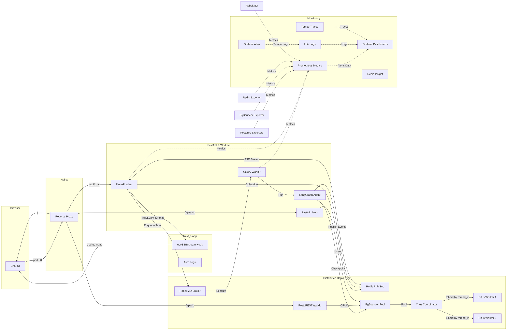

# fictional-bassoon

High-performance, full-stack AI chat application designed to stream real-time agent reasoning, tool calls, and final answers. Built for industrial scalability and high visibility.

## Overview

This project is a showcase of distributed systems engineering applied to AI agents. It streams real-time agent reasoning, tool calls, tool results, and final answers to the browser via **Server-Sent Events (SSE)**. The architecture offloads heavy "Deep Agent" workloads to asynchronous workers, utilizes a sharded database cluster for infinite state persistence, and provides complete observability across the entire stack.

## Architecture



## Key Design Decisions

- **SSE over WebSockets**  
  Simpler, more reliable streaming model for server → client updates. Leverages standard HTTP and provides automatic keep-alive support via FastAPI's `EventSourceResponse`.

- **Celery + RabbitMQ for Orchestration**  
  Decouples the long-running agent reasoning process from the HTTP request lifecycle, ensuring the API remains responsive.

- **PostgREST for Automated CRUD**  
  Exposes the Postgres database directly as a REST API for standard data operations (user profiles, message history), removing the need for boilerplate FastAPI CRUD endpoints.

- **Redis Pub/Sub for Event Streaming**  
  Acts as a high-performance bridge between distributed Celery workers and the SSE-enabled API gateway.

- **Dual PgBouncer Pools (Transaction + Session)**  
  Optimizes database connectivity by separating short-lived API queries from long-lived agent state connections.

- **Citus for Horizontal Scaling**  
  Shards LangGraph agent state by `thread_id` across a multi-node cluster, ensuring the system can handle millions of concurrent conversations.

- **Nginx as Unified Gateway**  
  Provides a single entry point for the frontend, the streaming API, and the PostgREST data layer, while optimizing for SSE performance.

- **LGTM Stack for Observability**  
  Full integration of Loki (logs), Grafana (dashboards), Tempo (tracing), and Prometheus (metrics) across all distributed boundaries.

## Project Structure

```
fictional-bassoon/
├── docker/                     # Master Orchestration
│   ├── docker-compose.yml      # Unified Stack Config
│   └── nginx/                  # Reverse Proxy Config
├── backend/                    # FastAPI Backend
│   ├── main.py                 # API Entry Point (/chat, /auth)
│   ├── src/                    # Logic, Models, & Auth
│   ├── docker/                 # Monitoring & Citus Config
│   └── docker-compose.yaml     # Backend-specific Stack
└── frontend/                   # Next.js Frontend
    ├── src/                    # UI Components & Context
    └── docker-compose.yaml     # Frontend-specific Stack
```

## Quick Start (Unified Stack)

The easiest way to run the entire application is using the master Docker Compose:

```bash
cd docker
docker compose up -d
```

This will start the unified gateway on [http://localhost](http://localhost).

## Local Development

### 1. Start Infrastructure
```bash
cd backend
docker compose up -d
```

### 2. Backend Setup
```bash
cd backend
uv sync
source .venv/bin/activate
celery -A src.celery_app worker --loglevel=info &
uvicorn main:app --reload
```

### 3. Frontend Setup
```bash
cd frontend
npm install
npm run dev
```

## Monitoring & Observability

Consolidated access through Nginx and direct ports:

| Service | Proxy URL | Direct URL | Purpose |
|---|---|---|---|
| **Chat UI** | [http://localhost](http://localhost) | [http://localhost:3000](http://localhost:3000) | Main Application |
| **API Docs** | [http://localhost/api/docs](http://localhost/api/docs) | [http://localhost:8000/docs](http://localhost:8000/docs) | API Reference |
| **PostgREST** | [http://localhost/api/db](http://localhost/api/db) | [http://localhost:3002](http://localhost:3002) | Data Explorer |
| **Grafana** | - | [http://localhost:3001](http://localhost:3001) | Dashboards & Logs |
| **Prometheus** | - | [http://localhost:9090](http://localhost:9090) | Metrics |
| **Redis Insight** | - | [http://localhost:5540](http://localhost:5540) | Redis GUI |

## TODOs

- [x] **Frontend Authentication:** Implement Login/Signup pages using the new FastAPI `/auth` endpoints.
- [x] **JWT Integration:** Add `AuthContext` to manage tokens and inject them into PostgREST (`/api/db`) requests.
- [x] **Data Migration:** Move existing conversation state into PostgREST-managed tables for user visibility.
- [x] **Persistent Threads:** Fetch thread lists from PostgREST instead of local state.
- [x] **Test Coverage:** Improve test coverage to 90%
