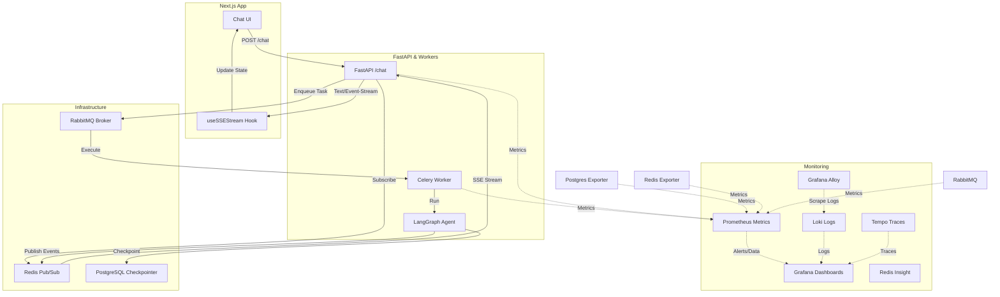

# fictional-bassoon

FastAPI SSE streaming backend for a LangGraph Deep Agent, paired with a Next.js chat frontend.

## Overview

This project is a full-stack AI chat application that streams real-time agent reasoning, tool calls, tool results, and final answers to the browser via Server-Sent Events (SSE). It features a robust, distributed architecture designed for observability and scalability.

## Architecture



## Project Structure

```
fictional-bassoon/
├── backend/                    # FastAPI Backend
│   ├── main.py                 # API Entry Point (/chat, /health)
│   ├── src/
│   │   ├── agent.py            # LangGraph Agent Construction
│   │   ├── celery_app.py       # Celery & Metrics Server Config
│   │   ├── models/             # Pydantic Schemas
│   │   ├── queue/              # Redis Pub/Sub Helpers
│   │   └── worker/             # Task Definitions & Runner
│   ├── utils/                  # Streaming & SSE Utilities
│   ├── docker/                 # Dockerfiles & Monitoring Config
│   │   └── monitoring/         # Grafana, Prometheus, Loki, etc.
│   ├── tests/                  # Backend Test Suite
│   └── docker-compose.yaml     # Infrastructure & Monitoring Stack
│
└── frontend/                   # Next.js Frontend
    ├── src/
    │   ├── app/                # App Router Pages & Styles
    │   ├── components/         # Chat & Sidebar UI Components
    │   ├── context/            # React State (ThreadContext)
    │   ├── hooks/              # Custom Hooks (useSSEStream)
    │   └── types/              # TypeScript Definitions
    └── docker/                 # Frontend Dockerfile
```

## Quick Start

### 1. Start Infrastructure & Monitoring
Ensure Docker is running and start the core services:
```bash
cd backend
docker compose up -d
```
*This starts Postgres, Redis, RabbitMQ, and the full monitoring stack (Grafana, Prometheus, Loki, Tempo, Alloy).*

### 2. Backend Setup
```bash
cd backend
uv sync
source .venv/bin/activate

# Start Celery Worker (Required)
celery -A src.celery_app worker --loglevel=info

# Start FastAPI Server
uvicorn main:app --reload
```

### 3. Frontend Setup
```bash
cd frontend
npm install
npm run dev
```

## Monitoring & Observability

The project includes a comprehensive monitoring suite available out-of-the-box:

| Service | URL | Purpose |
|---|---|---|
| **FastAPI** | [http://localhost:8000](http://localhost:8000) | Backend API |
| **Next.js** | [http://localhost:3000](http://localhost:3000) | Chat UI |
| **Grafana** | [http://localhost:3001](http://localhost:3001) | Dashboards & Logs |
| **Prometheus** | [http://localhost:9090](http://localhost:9090) | Metrics Scraper |
| **Redis Insight** | [http://localhost:5540](http://localhost:5540) | Redis GUI |
| **RabbitMQ Mgmt** | [http://localhost:15672](http://localhost:15672) | Broker Management |

### Custom Dashboards
- **FastAPI Metrics & Logs:** Real-time request rates, durations, and combined logs from Backend and Worker.
- **Microservice Health:** High-level "Up/Down" status for all infrastructure components.

## API Reference

### POST /chat
Starts a streaming agent session. Returns an SSE stream.
**Event types:** `reasoning`, `tool_call`, `tool_result`, `answer`, `agent`, `error`, `done`.

## Technology Stack
- **Backend:** FastAPI, LangGraph, Celery, Redis Pub/Sub, PostgreSQL.
- **Frontend:** Next.js 14, TypeScript, Tailwind CSS, Lucide React.
- **Observability:** LGTM Stack (Loki, Grafana, Tempo, Prometheus/Alloy).
