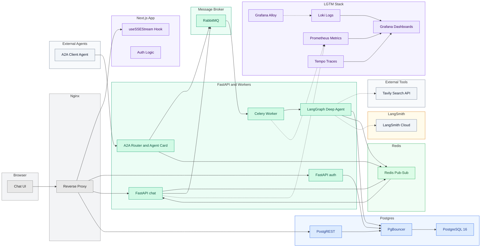
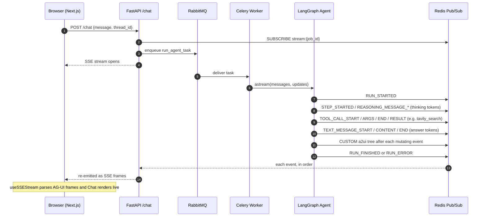

# fictional-bassoon

High-performance, full-stack AI chat application designed to stream real-time agent reasoning, tool calls, and final answers. Built for industrial scalability and high visibility.

## Overview

This project is a showcase of distributed systems engineering applied to AI agents. It streams real-time agent reasoning, tool calls, tool results, and final answers to the browser via **Server-Sent Events (SSE)**, speaking the **[AG-UI protocol](https://docs.ag-ui.com/)** event vocabulary end-to-end. The architecture offloads heavy "Deep Agent" workloads to asynchronous workers, persists conversation state in a single PostgreSQL instance behind PgBouncer, and traces LLM runs with LangSmith.

The app is built on three open agent protocols (all version-pinned — see `.claude/rules/protocol-version-pinning.md`):

| Protocol | Role here | Where |
|---|---|---|
| **AG-UI** (`ag-ui-protocol==0.1.21`) | Agent → frontend event stream over SSE: `RUN_*`, `STEP_*`, `TEXT_MESSAGE_*`, `REASONING_MESSAGE_*`, `TOOL_CALL_*` | `backend/utils/streaming.py` → `frontend/src/hooks/useSSEStream.ts` |
| **A2UI** (spec v1.0, scoped subset) | Declarative frontend rendering via a validated component allow-list (`column` / `reasoning` / `tool_call` / `markdown`) — no data binding, no executable UI | `frontend/src/lib/a2ui/` |
| **A2A** (`a2a-sdk[fastapi]==1.1.2`) | Exposes the backend as a callable service for other agents: Agent Card + JSON-RPC, with `taskId` == `job_id` and `contextId` == `thread_id` (one ID system, not three) | `backend/src/protocol/` — `GET /.well-known/agent-card.json`, `POST /a2a` |

## Architecture


```mermaid
graph LR
    classDef browser fill:#e8e8e8,stroke:#888,color:#222
    classDef frontend fill:#ede9fe,stroke:#7c3aed,color:#3b0764
    classDef backend fill:#d1fae5,stroke:#059669,color:#064e3b
    classDef postgres fill:#dbeafe,stroke:#2563eb,color:#1e3a8a
    classDef redis fill:#dcfce7,stroke:#16a34a,color:#14532d
    classDef observability fill:#fef3c7,stroke:#d97706,color:#78350f
    classDef monitoring fill:#ede9fe,stroke:#7c3aed,color:#3b0764
    classDef external fill:#f1f5f9,stroke:#64748b,color:#0f172a

    subgraph Client [Browser]
        UI[Chat UI]
    end
    subgraph Proxy [Nginx]
        NG[Reverse Proxy]
    end
    subgraph Frontend [Next.js App]
        SSE[useSSEStream Hook]
        Auth[Auth Logic]
    end
    subgraph Backend [FastAPI and Workers]
        API[FastAPI chat]
        AuthAPI[FastAPI auth]
        A2A[A2A Router and Agent Card]
        Worker[Celery Worker]
        Agent[LangGraph Deep Agent]
    end

    subgraph Peers [External Agents]
        A2AClient[A2A Client Agent]
    end

    subgraph Tools [External Tools]
        Tavily[Tavily Search API]
    end

    subgraph Observability [LangSmith]
        LangSmith[LangSmith Cloud]
    end

    subgraph BrokerBox [Message Broker]
        Broker[RabbitMQ]
    end

    subgraph RedisBox [Redis]
        PubSub[Redis Pub-Sub]
    end

    subgraph PostgresBox [Postgres]
        PgB[PgBouncer]
        PGRST[PostgREST]
        PG[PostgreSQL 16]
    end

    subgraph Monitoring [LGTM Stack]
        Alloy[Grafana Alloy]
        Loki[Loki Logs]
        Prom[Prometheus Metrics]
        Tempo[Tempo Traces]
        Grafana[Grafana Dashboards]
    end

    UI --> NG
    NG --> SSE
    NG --> AuthAPI
    NG --> API
    NG --> PGRST
    API --> PubSub
    API --> Broker
    A2AClient --> A2A
    A2A --> Broker
    A2A --> PubSub
    Broker --> Worker
    Worker --> Agent
    Agent -.-> Tavily
    Agent --> PgB
    PGRST --> PgB
    AuthAPI --> PgB
    PgB --> PG
    Agent --> PubSub
    PubSub --> API
    Agent -.-> LangSmith
    Worker -.-> Prom
    API -.-> Prom
    Alloy -.-> Loki
    Prom --> Grafana
    Loki --> Grafana
    Tempo --> Grafana

    class UI,NG browser
    class SSE,Auth frontend
    class API,AuthAPI,A2A,Worker,Agent,Broker backend
    class A2AClient,Tavily,LangSmith external
    class PgB,PGRST,PG postgres
    class PubSub redis
    class Alloy,Loki,Prom,Tempo,Grafana monitoring

    style Client fill:#f3f4f6,stroke:#888
    style Peers fill:#f8fafc,stroke:#64748b
    style Proxy fill:#f3f4f6,stroke:#888
    style Frontend fill:#f5f3ff,stroke:#7c3aed
    style Backend fill:#ecfdf5,stroke:#059669
    style Tools fill:#f8fafc,stroke:#64748b
    style BrokerBox fill:#ecfdf5,stroke:#059669
    style RedisBox fill:#f0fdf4,stroke:#16a34a
    style PostgresBox fill:#eff6ff,stroke:#2563eb
    style Observability fill:#fffbeb,stroke:#d97706
    style Monitoring fill:#f5f3ff,stroke:#7c3aed
```

## How a chat message streams


```mermaid
sequenceDiagram
    autonumber
    participant B as Browser (Next.js)
    participant F as FastAPI /chat
    participant Q as RabbitMQ
    participant W as Celery Worker
    participant A as LangGraph Agent
    participant R as Redis Pub/Sub

    B->>F: POST /chat {message, thread_id}
    F->>R: SUBSCRIBE stream:{job_id}
    F->>Q: enqueue run_agent_task
    F-->>B: SSE stream opens
    Q->>W: deliver task
    W->>A: astream(messages, updates)
    A->>R: RUN_STARTED
    A->>R: STEP_STARTED / REASONING_MESSAGE_* (thinking tokens)
    A->>R: TOOL_CALL_START / ARGS / END / RESULT (e.g. tavily_search)
    A->>R: TEXT_MESSAGE_START / CONTENT / END (answer tokens)
    A->>R: CUSTOM a2ui tree after each mutating event
    A->>R: RUN_FINISHED or RUN_ERROR
    R-->>F: each event, in order
    F-->>B: re-emitted as SSE frames
    Note over B: useSSEStream parses AG-UI frames and Chat renders live
```

The same pipeline is reachable by other agents over **A2A**: a JSON-RPC `SendMessage` to `POST /a2a` enqueues the identical Celery task and maps the AG-UI terminal events onto A2A task states (`submitted → working → completed/failed`), with a 120s idle timeout guarding against dead workers.

## Key Design Decisions

- **Protocol-driven surfaces (AG-UI · A2UI · A2A)**
  The agent↔frontend stream, the rendering contract, and the service-to-service interface each follow an open protocol instead of a hand-rolled vocabulary. Versions are pinned and verified against the installed packages (`.claude/rules/protocol-version-pinning.md`); the A2UI implementation is a deliberately scoped, non-executable subset (`column`/`reasoning`/`tool_call`/`markdown` only).

- **SSE over WebSockets**
  Simpler, more reliable streaming model for server → client updates. Leverages standard HTTP and provides automatic keep-alive support via FastAPI's `EventSourceResponse`.

- **Celery + RabbitMQ for Orchestration**
  Decouples the long-running agent reasoning process from the HTTP request lifecycle, ensuring the API remains responsive.

- **PostgREST for Automated CRUD**
  Exposes the Postgres database directly as a REST API for standard data operations (user profiles, message history), removing the need for boilerplate FastAPI CRUD endpoints.

- **Single Redis for pub/sub**
  One Redis container carries the `stream:{job_id}` channel between the Celery worker and FastAPI. Sentinel / replica HA was unused by the app path and added six extra containers plus exporters.

- **PgBouncer in front of one Postgres**
  FastAPI, Celery, and PostgREST all connect through transaction-mode PgBouncer on `:6432`. PostgREST's contract is unchanged (`api` schema, `anon` / `web_user` / `authenticator`, JWT).

- **`thread_id` is the one session key**
  `api.threads.id`, LangGraph checkpoints, AG-UI run IDs, and A2A `contextId` all resolve to the same `thread_id`. No Citus distribution — see `.claude/rules/citus-thread-id-integrity.md`.

- **LangSmith for LLM traces**
  LangGraph emits traces to LangSmith when `LANGSMITH_API_KEY` + `LANGSMITH_TRACING=true` are set. No local Langfuse / ClickHouse / MinIO cluster.

- **LGTM Stack for Infrastructure Monitoring**
  Full integration of Loki (logs), Grafana (dashboards), Tempo (tracing), and Prometheus (metrics) across all distributed boundaries.

## Project Structure

```
fictional-bassoon/
├── docker/                     # Master Orchestration
│   ├── docker-compose.yml      # Unified Stack Config
│   └── nginx/                  # Reverse Proxy Config
├── backend/                    # FastAPI Backend
│   ├── main.py                 # API Entry Point (/chat, /auth)
│   ├── src/                    # Logic, Models, & Auth
│   ├── docker/                 # Postgres init, RabbitMQ plugins, LGTM config
│   └── docker-compose.yaml     # Backend-specific Stack
└── frontend/                   # Next.js Frontend
    ├── src/                    # UI Components & Context
    └── docker-compose.yaml     # Frontend-specific Stack
```

## Quick Start (Unified Stack)

The easiest way to run the entire application is through the Makefile (which drives the master Docker Compose in `docker/`):

```bash
make up          # start all services (detached)
make up-build    # rebuild images, then start
make logs        # follow logs
make down        # stop and remove containers
make clean       # remove volumes and images too
```

You'll need `backend/.env` populated first (see the table in `backend/README.md` — at minimum `OPENAI_API_KEY` and `TAVILY_API_KEY`). Once up:

- Chat UI: [http://localhost:3000](http://localhost:3000) (or via nginx at [http://localhost](http://localhost))
- A2A Agent Card: [http://localhost:8000/.well-known/agent-card.json](http://localhost:8000/.well-known/agent-card.json)

## Local Development

### 0. Pre-commit Hooks Setup (First Time Only)

This project uses [pre-commit](https://pre-commit.com/) to automatically run linters, formatters, and type checkers before commits.

```bash
# Install pre-commit framework
uv pip install pre-commit

# Install git hooks into your repository
pre-commit install

# Install frontend dependencies
cd frontend && npm install && cd ..
```

After setup, hooks will run automatically on every `git commit`. To manually test:
```bash
pre-commit run --all-files
```

**Hooks configured:**
- **Backend:** Ruff (linting), Mypy (type checking)
- **Frontend:** ESLint, Prettier, TypeScript type checking, Vitest tests
- **General:** YAML validation, file formatting checks

### 1. Start Infrastructure
```bash
cd backend
docker compose up -d
```

### 2. Backend Setup
```bash
cd backend
uv sync
source .venv/bin/activate
celery -A src.celery_app worker --loglevel=info &
uvicorn main:app --reload
```

### 3. Frontend Setup
```bash
cd frontend
npm install
npm run dev
```

## Testing

Both stacks hold a ≥90% coverage gate (statements/lines):

```bash
# Backend — 95% coverage
cd backend && uv run pytest -q --cov=.

# Frontend — 93.97% statements / 95.35% lines
cd frontend && npm run test:coverage
```

## Monitoring & Observability

Consolidated access through Nginx and direct ports:

| Service | Proxy URL | Direct URL | Purpose |
|---|---|---|---|
| **Chat UI** | [http://localhost](http://localhost) | [http://localhost:3000](http://localhost:3000) | Main Application |
| **API Docs** | [http://localhost/api/docs](http://localhost/api/docs) | [http://localhost:8000/docs](http://localhost:8000/docs) | API Reference |
| **LangSmith** | - | [https://smith.langchain.com](https://smith.langchain.com) | LLM Tracing |
| **PostgREST** | [http://localhost/api/db](http://localhost/api/db) | [http://localhost:3002](http://localhost:3002) | Data Explorer |
| **Grafana** | - | [http://localhost:3001](http://localhost:3001) | Dashboards & Logs |
| **Prometheus** | - | [http://localhost:9090](http://localhost:9090) | Metrics |
| **RabbitMQ** | - | [http://localhost:15672](http://localhost:15672) | Broker management UI |
