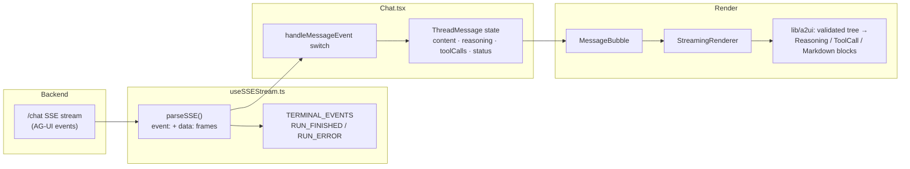

# Frontend

Next.js chat application for the fictional-bassoon AI agent.

## Overview

This is a real-time chat interface that streams agent reasoning, tool calls, tool results, and final answers via Server-Sent Events (SSE), consuming the **AG-UI protocol** event vocabulary emitted by the backend. Rendering of agent output follows a deliberately scoped **A2UI** subset: a validated, allow-listed component tree with no data binding, no renderer-side function calls, and no executable UI.

The frontend consists of three main areas:

1. **Authentication** — Login/Signup forms (JWT via `POST /auth/*`).
2. **Sidebar** — List of conversation threads (persisted through PostgREST).
3. **Chat area** — Message list with streaming renderer and user input form.

## How events become UI



Event handling in `Chat.tsx`:

| AG-UI event | Effect on the assistant message |
|---|---|
| `REASONING_MESSAGE_CONTENT` | append `delta` to `reasoning` |
| `TEXT_MESSAGE_CONTENT` | append `delta` to `content` |
| `TOOL_CALL_START` / `ARGS` / `RESULT` | create / accumulate args on / resolve a tool call, keyed by `toolCallId` |
| `RUN_FINISHED` | finalize with `status: 'done'` (persisted) |
| `RUN_ERROR` | finalize with `status: 'error'` + error text — rendered as a red error bubble and persisted |
| lifecycle markers (`RUN_STARTED`, `STEP_*`, `*_START`/`*_END`) | no state change |

## Tech Stack

| Technology                  | Purpose                          |
| --------------------------- | -------------------------------- |
| Next.js 14 (App Router)     | React framework                  |
| TypeScript (strict mode)    | Type safety                      |
| Tailwind CSS                | Utility-first styling            |
| react-markdown + remark-gfm | Sanitized markdown rendering     |
| Lucide React                | Icon library                     |
| Custom SSE hook             | AG-UI event consumption          |
| Vitest + Testing Library    | Tests (93.97% stmts / 95.35% lines) |

The A2UI layer intentionally does **not** install `@a2ui/web_core` / `@a2ui/react` — it implements a small subset of the v1.0 spec instead (four allow-listed components: `column`, `reasoning`, `tool_call`, `markdown`). The reasons are recorded in `.claude/rules/protocol-version-pinning.md`.

## Installation

```bash
cd frontend

# Install dependencies
npm install

# Create environment file
cp .env.example .env.local 2>/dev/null || echo 'NEXT_PUBLIC_API_URL=http://localhost:8000' > .env.local
```

## Running the App

```bash
# Start the dev server (backend must be reachable at NEXT_PUBLIC_API_URL)
npm run dev

# Open http://localhost:3000 in your browser
```

## Project Structure

```
frontend/
├── src/
│   ├── app/
│   │   ├── layout.tsx           # Root layout, AuthProvider
│   │   ├── page.tsx             # Chat entry point
│   │   ├── login/               # Login page
│   │   └── signup/              # Signup page
│   ├── components/
│   │   ├── chat/                # Chat, MessageBubble, StreamingRenderer, input
│   │   └── sidebar/             # Thread navigation
│   ├── context/
│   │   ├── AuthContext.tsx      # Authentication state (JWT)
│   │   └── ThreadContext.tsx    # Thread state + persistence (PostgREST)
│   ├── hooks/
│   │   └── useSSEStream.ts      # SSE transport + AG-UI event parsing
│   ├── lib/
│   │   └── a2ui/
│   │       ├── schema.ts        # Scoped A2UI component-tree types
│   │       ├── allowList.ts     # The four permitted component types
│   │       ├── validator.ts     # Rejects anything outside the allow-list
│   │       ├── renderer.tsx     # Tree → React components
│   │       ├── components/      # ColumnBlock, ReasoningBlock, ToolCallBlock, MarkdownBlock
│   │       └── agui/            # AG-UI event parsing + stream-state reducer
│   └── types/
│       └── index.ts             # AGUIEventType union, ThreadMessage, Thread, …
```

## SSE Integration

The transport lives in `src/hooks/useSSEStream.ts`: a `fetch()` + `ReadableStream` reader against `POST /chat` (deliberately not `EventSource`, which can't POST — see `.claude/rules/sse-transport-lock.md`). Each frame carries the AG-UI event name on `event:` and the camelCase event JSON on `data:`. The stream ends on `RUN_FINISHED` or `RUN_ERROR` — exactly one terminal event per run.

## Styling

- **Tailwind CSS** — all styling uses Tailwind utility classes.
- **Dark mode** — `html.dark` class on root layout.

## Scripts

```bash
npm run dev            # Start dev server
npm run build          # Production build
npm run lint           # ESLint
npm run format         # ESLint + Prettier
npm run test           # Vitest (188 tests)
npm run test:coverage  # Vitest + v8 coverage (gate: ≥90% statements/lines)
```
